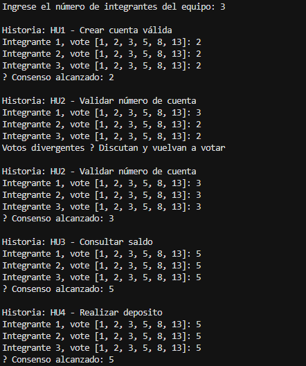
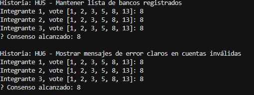
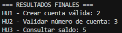
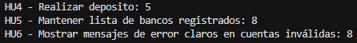
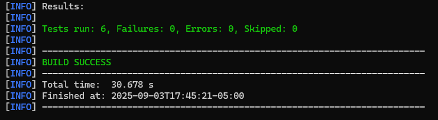

# -Laboratorio-3-DOSW
# Integrantes
- Juan Diego Rodriguez Velasquez 
- Daniel Felipe Hueso
- Maria Paula Rodriguez Muñoz

# Reto 1: Identificando los Requerimientos

## Reglas de negocios a tener en cuenta: 
- Los números de cuenta deben tener exactamente 10 dígitos.
- Una cuenta solo es válida si sus 2 primeros dígitos corresponden a un banco registrado.
- Los números de cuenta no pueden contener letras ni caracteres especiales, solo números.
- Solo se pueden realizar operaciones sobre cuentas válidas y registradas en el sistema.
- Los depósitos deben aumentar el saldo de la cuenta de manera correcta.
- Las consultas de saldo deben mostrar la información actualizada.

## Las principales funcionalidades serian : 

- Crear una cuenta bancaria 
- Validar el numero de cuenta 
- Consultar saldo de la cuenta 
- Realizar depósitos 

## Precondiciones del sistema serian : 
- Debe existir un listado de bancos registrados
- El sistema debe tener una base de datos activa para almacenar cuenta y saldos. 
- El cliente debe registrar una cuenta valida antes de poder consultar el saldo o hacer depósitos.
- El sistema debe garantizar la seguridad y validación de datos (no puedfe tener duplicados ni cuentas invalidas)

# Reto 2: Diseñando

## 1. Explicacion diagrama de contexto 

- Cliente/Usuario: actor que interactúa con la interfaz (web o API) para crear cuentas, consultar saldo y depositar.

- Interfaz (UI/API): puerta de entrada que valida entradas simples y reenvía las solicitudes al Sistema Bankify.

- Sistema Bankify: nucleo que aplica reglas de negocio (10 dígitos, codigos de banco, solo digitos), 
gestiona saldos y registra transacciones.

- Base de datos: almacena cuentas, saldos y logs de operaciones.

- Bancos registrados: fuente de verdad para los códigos de bancos. El sistema puede tener una tabla local con esos códigos o consultar un servicio externo.

## 2. Diagrama de casos de uso en UML

## 3. Historias de usuario

- Como Cliente, quiero crear una cuenta bancaria proporcionando un numero de cuenta válido,
para poder guardar mi cuenta en Bankify y operar con ella.

- Como Cliente, quiero que el sistema valide que el numero de cuenta tenga exactamente 10 digitos y
que los 2 primeros correspondan a un banco registrado, para asegurar que la cuenta es válida antes de crearla.

- Como Cliente, quiero consultar el saldo de mi cuenta, para conocer cuánto dinero tengo disponible.

- Como Cliente, quiero depositar dinero en mi cuenta, para aumentar mi saldo y poder realizar operaciones futuras.

- Como Administrador del sistema, quiero mantener la lista de bancos registrados 
(códigos de 2 dígitos), para que las validaciones de cuentas sean correctas y actualizables.

- Como Cliente, quiero recibir mensajes de error claros si intento operar con una cuenta invalida,
para corregir los datos y volver a intentar.
## 4. Historia de usuario archivo Excel 

## 5. Diagrama de clases:

# Reto 3: Una estimación automatizada

## Implementación
La lógica principal se encuentra en las siguientes clases:

- `PlanningPoker.java`: Implementa el flujo principal de votación por historia.
- `EstrategiaDeVotacion.java`: Interface base para definir estrategias de consenso.
- `EstrategiaDeConsenso.java`: Estrategia actual que valida votos iguales para definir consenso.

    (Evidencia en el código)

## Principios y patrones utilizados

1. **Principio de Responsabilidad Única (SRP)**  
   Cada clase tiene una única responsabilidad.  
   - `GestionCuenta` maneja exclusivamente la gestión de cuenta
   - `SesionPlanningPoker` coordina las sesiones de votación
   Esto facilita el mantenimiento y reduce la complejidad

2. **Principio Abierto/Cerrado (OCP)**  
   El sistema está abierto a extensión pero cerrado a modificación.  
   - Se pueden agregar nuevas estrategias de votación sin modificar las clases existentes 

3. **Principio de Inversión de Dependencias (DIP)**  
   Las clases dependen de abstracciones y no de implementaciones concretas.  
   - `SesionPlanningPoker` depende de la interfaz `EstrategiaDeVotacion` en lugar de una estrategia fija

4. **Principio de Sustitución de Liskov (LSP)**  
   Cualquier implementación de `EstrategiaDeVotacion` puede sustituirse sin romper el sistema

5. **Principio de Segregación de Interfaces (ISP)**  
   Las interfaces son específicas y pequeñas. `EstrategiaDeVotacion` define solo lo necesario para las votaciones

6. **Patrón Strategy**  
   `ValidadorCuenta` puede extenderse fácilmente con nuevas estrategias de validación sin modificar lo que ya está 

## Evidencia Votaciones

# Reto 3: Tiempo de desarrollo

## Implementacion de las clases y clases de pruebas(En el código)

## Evidencia pruebas exitosas

## Principios y Patrones Utilizados

1. **S – Single Responsibility Principle (SRP)**  
  Cada clase tiene una única responsabilidad.  
  - `ValidadorCuenta` → valida datos de cuentas.  
  - `GestionCuenta` → maneja operaciones sobre cuentas.

2. **Strategy**  
  Permite cambiar dinámicamente la estrategia de validación.  
  `ValidadorCuenta` y cualquier nueva clase de validación que se agregue.

